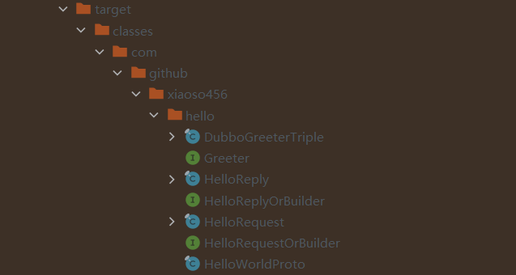
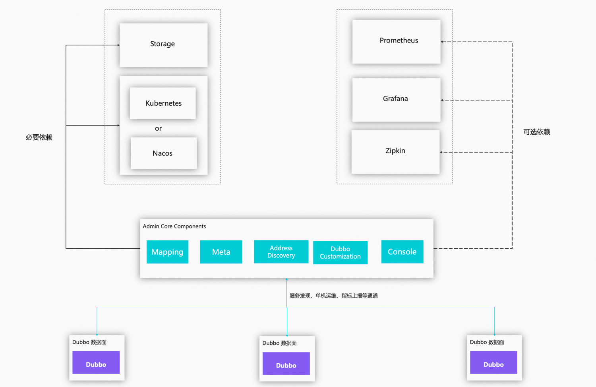

## 简介

Apache Dubbo 是一款易用的、提供高性能通信和服务治理能力的微服务开发框架，Dubbo 提供多种语言实现

文档官网：[Dubbo 文档 | Apache Dubbo](https://cn.dubbo.apache.org/zh-cn/overview/home/#)

## 开始之前

文本会使用 nacos2.1.0 作为注册中心，而不是内置的 embedded-zookeeper，减少官网使用低版本 zookeeper 造成的通信 bug

## 快速开始

本例由官方 dubbo-samples 项目 dubbo-samples-api 修改而来

1. 启动注册中心
2. 引入依赖

```xml
        <dependency>
   <groupId>com.alibaba.nacos</groupId>
   <artifactId>nacos-client</artifactId>
   <version>2.1.2</version>
</dependency>
<dependency>
<groupId>org.apache.dubbo</groupId>
<artifactId>dubbo</artifactId>
<version>3.2.0-beta.4</version>
</dependency>


<dependency>
<groupId>org.slf4j</groupId>
<artifactId>slf4j-api</artifactId>
<version>1.7.36</version>
</dependency>

<dependency>
<groupId>org.slf4j</groupId>
<artifactId>slf4j-reload4j</artifactId>
<version>1.7.36</version>
</dependency>

<dependency>
<groupId>ch.qos.reload4j</groupId>
<artifactId>reload4j</artifactId>
<version>1.2.24</version>
</dependency>
```

3. 新建 log4j.properties 文件配置日志

   ```properties
   ###set log levels###
   log4j.rootLogger=info, stdout
   ###output to the console###
   log4j.appender.stdout=org.apache.log4j.ConsoleAppender
   log4j.appender.stdout.Target=System.out
   log4j.appender.stdout.layout=org.apache.log4j.PatternLayout
   log4j.appender.stdout.layout.ConversionPattern=[%d{dd/MM/yy hh:mm:ss:sss z}] %t %5p %c{2}: %m%n
   ```

4. 新建接口 GreetingsService.java

```java
public interface GreetingsService {
   String sayHi(String name);
}
```

5. 新建 provider 包，表示服务提供者

新建 GreetingsServiceImpl.java 实现 GreetingsService 接口

```java
public class GreetingsServiceImpl implements GreetingsService {
   @Override
   public String sayHi(String name) {
      return "hi, " + name;
   }
}
```

新建 Application.java，向注册中心注册服务提供者

```java
public class Application {

   public static void main(String[] args) {
      // 服务配置
      ServiceConfig<GreetingsService> service = new ServiceConfig<>();
      service.setInterface(GreetingsService.class);
      service.setRef(new GreetingsServiceImpl());

      // 启动服务提供者实例
      DubboBootstrap.getInstance()
              .application("first-dubbo-provider")
              // 这里是注册中心地址
              .registry(new RegistryConfig("nacos://localhost:8848"))
              // 使用 dubbo 协议，随机端口
              .protocol(new ProtocolConfig("dubbo", -1))
              .service(service)
              .start()
              .await();
   }
}

```

6. 新建 client 包，作为服务消费者

新建 AlwaysApplication.java，持续通过 dubbo 调用远程服务

```java
public class AlwaysApplication {

   public static void main(String[] args){
      ReferenceConfig<GreetingsService> reference = new ReferenceConfig<>();
      reference.setInterface(GreetingsService.class);

      DubboBootstrap.getInstance()
              .application("first-dubbo-consumer")
              .registry(new RegistryConfig("nacos://localhost:8848"))
              .reference(reference)
              .start();

      GreetingsService service = reference.get();
      while (true) {
         try {
            String message = service.sayHi("dubbo");
            System.out.println(new Date() + " Receive result ======> " + message);
            Thread.sleep(1000);
         } catch (Throwable t) {
            t.printStackTrace();
         }
      }
   }

}
```

7. 依次启动

   + 服务提供者 provider/Application.java
   + 服务消费者 client/AlwaysApplication.java

8. 观察输出结果

   ```
   Sun Mar 05 19:07:11 CST 2023 Receive result ======> hi, dubbo
   Sun Mar 05 19:07:12 CST 2023 Receive result ======> hi, dubbo
   ```

## 使用

###  Dubbo + SpringBoot

建议直接 clone 项目 [dubbo-samples-nacos](https://github.com/xiaoso456/dubbo-samples-nacos/tree/master)

```
git clone https://github.com/xiaoso456/dubbo-samples-nacos.git
```

查看 basic 模块 dubbo-samples-spring-boot，做了以下几件事

1. 新建普通 Maven 模块 dubbo-samples-spring-boot-interface，定义服务接口，需要使用 maven install 安装该模块到本地

```java
public interface DemoService {
    String sayHello(String name);
}
```

2. 新建 SpringBoot 模块 dubbo-samples-spring-boot-provider，**引用并实现 1 中模块接口**，自动向注册中心注册

```java
// 实现并注册 dubbo 服务
@DubboService
public class DemoServiceImpl implements DemoService {

    @Override
    public String sayHello(String name) {
        return "Hello " + name;
    }
}
```

```java
@SpringBootApplication
// 开启 dubbo
@EnableDubbo
public class ProviderApplication {
    public static void main(String[] args) {
        SpringApplication.run(ProviderApplication.class, args);
    }
}
```

3. 新建 SpringBoot 模块 dubbo-samples-spring-boot-consumer，从注册中心获取 dubbo 服务并使用

   如下代码，在 SpringBoot 启动后开启一个线程，每秒调用一次 DemoService 这个 dubbo 服务

```java
@Component
public class Task implements CommandLineRunner {
    // 注入 dubbo 服务
    @DubboReference
    private DemoService demoService;

    @Override
    public void run(String... args) throws Exception {
        String result = demoService.sayHello("world");
        System.out.println("Receive result ======> " + result);

        new Thread(()-> {
            while (true) {
                try {
                    Thread.sleep(1000);
                    System.out.println(new Date() + " Receive result ======> " + demoService.sayHello("world"));
                } catch (InterruptedException e) {
                    e.printStackTrace();
                    Thread.currentThread().interrupt();
                }
            }
        }).start();
    }
}
```

```java
@SpringBootApplication
// 开启 dubbo 服务注册发现
@EnableDubbo
public class ConsumerApplication {

    public static void main(String[] args) {
        SpringApplication.run(ConsumerApplication.class, args);
    }
}
```

然后，依次启动 provider、consumer 即可看到结果

### dubbo rest

该示例见 [xiaoso456/dubbo-samples-nacos (github.com)](https://github.com/xiaoso456/dubbo-samples-nacos/tree/master) `demo/dubbo-samples-springboot-rest`

3.2.x 后，dubbo 重新提供 rest 的方式发布接口，以便和 springcloud 打通

1. Interface 模块定义服务接口

```java
@RestController
@RequestMapping("/demo")
public interface DemoService {

    @RequestMapping(value = "/hello",method = RequestMethod.GET)
    String sayHello(String name);

}
```

2. 实现接口，并使用 rest 协议发布

```java
@DubboService(protocol = "rest")
@RequestMapping("/demo")
public class DemoServiceImpl implements DemoService {

    @Override
    @RequestMapping(value = "/hello",method = RequestMethod.GET)
    public String sayHello(@RequestParam("name") String name) {
        return "Hello " + name;
    }
}

```

配置文件 application.yml

```yaml
dubbo:
  application:
    name: dubbo-springboot-demo-provider
  protocol:
    name: rest
    port: 20000
  registry:
    address: nacos://localhost:8848
```

### Protobuf IDL 定义跨语言服务

使用 protobuf 序列化，dubbo 的 TRIPLE 协议提供服务，同时能够兼容 gRpc 调用

新建 proto/hello.proto

```protobuf
syntax = "proto3";

option java_multiple_files = true;
option java_package = "com.github.xiaoso456.hello";
option java_outer_classname = "HelloWorldProto";
option objc_class_prefix = "HLW";

package helloService;

message HelloRequest {
  string name = 1;
}

message HelloReply {
  string message = 1;
}
service Greeter{
  rpc greet(HelloRequest) returns (HelloReply);
}
```

新建 pom.xml

```xml
    <dependencies>
        <dependency>
            <groupId>com.alibaba.nacos</groupId>
            <artifactId>nacos-client</artifactId>
            <version>2.1.2</version>
        </dependency>
        <dependency>
            <groupId>org.apache.dubbo</groupId>
            <artifactId>dubbo</artifactId>
            <version>3.2.0-beta.4</version>
        </dependency>

        <dependency>
            <groupId>com.google.protobuf</groupId>
            <artifactId>protobuf-java</artifactId>
            <version>3.21.1</version>
        </dependency>


        <dependency>
            <groupId>org.slf4j</groupId>
            <artifactId>slf4j-api</artifactId>
            <version>1.7.36</version>
        </dependency>

        <dependency>
            <groupId>org.slf4j</groupId>
            <artifactId>slf4j-simple</artifactId>
            <version>1.7.36</version>
        </dependency>


    </dependencies>

    <build>
        <extensions>
            <extension>
                <groupId>kr.motd.maven</groupId>
                <artifactId>os-maven-plugin</artifactId>
                <version>1.6.1</version>
            </extension>
        </extensions>
        <plugins>
            <plugin>
                <groupId>org.xolstice.maven.plugins</groupId>
                <artifactId>protobuf-maven-plugin</artifactId>
                <version>0.6.1</version>
                <configuration>
                    <protocArtifact>com.google.protobuf:protoc:3.21.1:exe:${os.detected.classifier}</protocArtifact>
                    <protocPlugins>
                        <protocPlugin>
                            <id>dubbo</id>
                            <groupId>org.apache.dubbo</groupId>
                            <artifactId>dubbo-compiler</artifactId>
                            <version>3.2.0-beta.4</version>
                            <mainClass>org.apache.dubbo.gen.tri.Dubbo3TripleGenerator</mainClass>
                        </protocPlugin>
                    </protocPlugins>
                </configuration>
                <executions>
                    <execution>
                        <goals>
                            <goal>compile</goal>
                        </goals>
                    </execution>
                </executions>
            </plugin>
        </plugins>
    </build>
```

执行一次 `mvn clear install` 编译出 protobuf 接口文件，可以在 `/target/classes/com/github/xiaoso456/hello` 文件夹找到接口定义文件



新建 service 包，新建 GreeterImpl.java 实现类

```java
package com.github.xiaoso456.service;

import com.github.xiaoso456.hello.HelloReply;
import com.github.xiaoso456.hello.HelloRequest;

public class GreeterImpl extends com.github.xiaoso456.hello.DubboGreeterTriple.GreeterImplBase {
    @Override
    public HelloReply greet(HelloRequest request) {
        HelloReply helloReply = HelloReply.newBuilder()
                .setMessage("hello :" + request.getName())
                .build();
        return helloReply;
    }
}
```

新建 Provider.java

```java
public class Provider {
    public static void main(String[] args) throws IOException {
        ServiceConfig<com.github.xiaoso456.hello.Greeter> service = new ServiceConfig<>();
        service.setInterface(com.github.xiaoso456.hello.Greeter.class);
        service.setRef(new GreeterImpl());

        DubboBootstrap bootstrap = DubboBootstrap.getInstance();
        bootstrap.application(new ApplicationConfig("tri-stub-server"))
                .registry(new RegistryConfig("nacos://127.0.0.1:8848"))
                .protocol(new ProtocolConfig(CommonConstants.TRIPLE, 50051))
                .service(service)
                .start()
                .await();
    }
}
```

新建 Consumer.java

```java
public class Consumer {
    public static void main(String[] args) {
        DubboBootstrap bootstrap = DubboBootstrap.getInstance();
        ReferenceConfig<Greeter> ref = new ReferenceConfig<>();
        ref.setInterface(Greeter.class);
        ref.setProtocol(CommonConstants.TRIPLE);
        ref.setProxy(CommonConstants.NATIVE_STUB);
        ref.setTimeout(3000);
        bootstrap.application(new ApplicationConfig("tri-stub-client"))
                .registry(new RegistryConfig("nacos://127.0.0.1:8848"))
                .reference(ref)
                .start();

        Greeter greeter = ref.get();
        HelloRequest request = HelloRequest.newBuilder().setName("Demo Request App Client").build();
        HelloReply reply = greeter.greet(request);
        System.out.println("Received reply:" + reply);
    }
}

```

运行 provider、consumer，可以看到结果

```
Received reply:message: "hello :Demo Request App Client"
```


使用了 protobuf 序列化的 triple 协议兼容 grpc，可以使用 postman 进行测试，但值得注意的是，导入 proto 文件时，需要修改 proto 定义的 package 为 java 包名

```protobuf
syntax = "proto3";

option java_multiple_files = true;
option java_package = "com.github.xiaoso456.hello";
option java_outer_classname = "HelloWorldProto";
option objc_class_prefix = "HLW";

package com.github.xiaoso456.hello;

message HelloRequest {
  string name = 1;
}

message HelloReply {
  string message = 1;
}
service Greeter{
  rpc greet(HelloRequest) returns (HelloReply);
}
```


### 端口协议复用

dubbo 服务端可以在同一个端口解析多种协议


pom.xml 引入依赖

```xml
    <dependencies>
        <dependency>
            <groupId>com.alibaba.nacos</groupId>
            <artifactId>nacos-client</artifactId>
            <version>2.1.2</version>
        </dependency>
        <dependency>
            <groupId>org.apache.dubbo</groupId>
            <artifactId>dubbo</artifactId>
            <version>3.2.0-beta.4</version>
        </dependency>


        <dependency>
            <groupId>org.apache.dubbo</groupId>
            <artifactId>dubbo-rpc-triple</artifactId>
            <version>3.2.0-beta.4</version>
        </dependency>
        <dependency>
            <groupId>org.apache.dubbo</groupId>
            <artifactId>dubbo-rpc-dubbo</artifactId>
            <version>3.2.0-beta.4</version>
        </dependency>

        <dependency>
            <groupId>org.apache.dubbo</groupId>
            <artifactId>dubbo-remoting-api</artifactId>
            <version>3.2.0-beta.4</version>
        </dependency>
        <dependency>
            <groupId>org.apache.dubbo</groupId>
            <artifactId>dubbo-remoting-netty4</artifactId>
            <version>3.2.0-beta.4</version>
        </dependency>

        <dependency>
            <groupId>org.slf4j</groupId>
            <artifactId>slf4j-api</artifactId>
            <version>1.7.36</version>
        </dependency>

        <dependency>
            <groupId>org.slf4j</groupId>
            <artifactId>slf4j-simple</artifactId>
            <version>1.7.36</version>
        </dependency>


    </dependencies>
```

新建接口 GreetingService.java

```java
public interface GreetingService {
    String sayHello(String name);
}

```

新建实现类 GreetingServiceImpl.java

```java
public class GreetingServiceImpl implements GreetingService {
    @Override
    public String sayHello(String name) {
        return "hello : "+ name;
    }
}
```

新建 Provider.java，提供 dubbo + 额外 triple 协议

注意 dubbo 协议和 triple 协议位置不要对调，tri 为额外协议，否则会报错，原因未知

```java
public class Provider {
   public static void main(String[] args) {
      ServiceConfig<GreetingService> service = new ServiceConfig<>();
      service.setInterface(GreetingService.class);
      service.setRef(new GreetingServiceImpl());

      // 设置 dubbo 协议 + 额外 tri 协议
      ProtocolConfig protocolConfig = new ProtocolConfig(CommonConstants.DUBBO_PROTOCOL, 52000);
      protocolConfig.setExtProtocol(CommonConstants.TRIPLE + ",");


      DubboBootstrap bootstrap = DubboBootstrap.getInstance();
      bootstrap.application(new ApplicationConfig("port-unification-provider"))
              .registry(new RegistryConfig("nacos://127.0.0.1:8848"))
              .protocol(protocolConfig)
              .service(service)
              .start()
              .await();
   }
}

```

新建 DubboConsumer.java

```java
public class DubboConsumer {
   public static void main(String[] args) {
      DubboBootstrap bootstrap = DubboBootstrap.getInstance();
      ReferenceConfig<GreetingService> ref = new ReferenceConfig<>();
      ref.setInterface(GreetingService.class);
      ref.setProtocol(CommonConstants.DUBBO);
      bootstrap.application(new ApplicationConfig("dubbo-consumer"))
              .registry(new RegistryConfig("nacos://127.0.0.1:8848"))
              .reference(ref)
              .start();

      GreetingService greetingService = ref.get();

      String result = greetingService.sayHello("dubbo consumer");
      System.out.println(result);

   }
}
```

新建 TripleConsumer.java

```java
public class TripleConsumer {
   public static void main(String[] args) {
      DubboBootstrap bootstrap = DubboBootstrap.getInstance();
      ReferenceConfig<GreetingService> ref = new ReferenceConfig<>();
      ref.setInterface(GreetingService.class);
      ref.setProtocol(CommonConstants.TRIPLE);

      bootstrap.application(new ApplicationConfig("triple-consumer"))
              .registry(new RegistryConfig("nacos://127.0.0.1:8848"))
              .reference(ref)
              .start();

      GreetingService greetingService = ref.get();

      String result = greetingService.sayHello("triple consumer");
      System.out.println(result);

   }
}
```

依次执行，可以看到结果

## Dubbo Admin

Admin 是服务治理控制面中的一个核心组件，负责微服务集群的服务治理、可视化展示等



总体上来说，Admin 部署架构分为以下几个部分：

- Admin 主进程，包括服务发现元数据管理、可视化控制台、安全认证策略管控、其他定制化服务治理能力等组件。
- 强依赖组件，包括 Mysql 数据库、注册/配置/元数据中心（可以是 Kubernetes、Nacos、Zookeeper 等）
- 可选依赖组件，包括 Prometheus、Grafana、Zipkin 等


### 源码启动

dubbo admin目前不提供二进制包，可以通过源码/docker镜像/k8s helm 安装，这里使用源码启动

```sh
git clone https://github.com/apache/dubbo-admin.git
```

maven 编译打包

```
mvn package -Dmaven.test.skip=true -f pom.xml
```

启动 dubbo-admin-sever 模块主程序


## dubbo 模型


## 参考

[Dubbo 文档 | Apache Dubbo](https://cn.dubbo.apache.org/zh-cn/overview/home/#)

[Dubbo3.0入门教程 - 掘金 (juejin.cn)](https://juejin.cn/post/7258847745527791676)

[精选｜Dubbo异步化实践 - 掘金 (juejin.cn)](https://juejin.cn/post/7242476048005218359?searchId=20231004202749276F001D7D462446D2EE)