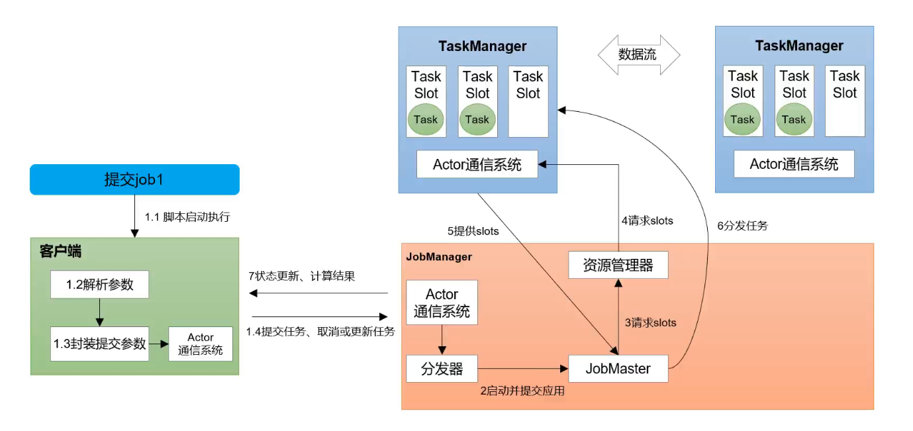

## 简介

Flink 是一个支持流处理和批处理的分布式计算框架

## 概念

### DataStream 

FLink中的数据集合，是可以包含重复项，不可变的数据集合，数据可以是有界也可以是无界

DataStream 是不可变的，一旦被创建，不能添加或删除

### 并行度 parallelism

数据量大时，把一个算子操作复制到多个节点，把一个算子任务拆分成多个并行子任务分发到不同节点

Flink 一个流的并行度，可以认为是算子中最大的并行度

### 算子链

oneToOne（web ui 图显示为 forwarding） 一对一关系，不需要调整数据顺序，不需要重分区

redistributing重分区(web ui 图显示为hash)

合并算子链：并行度相同，并且为oneToOne关系的算子可以合并成一个大任务

### 任务槽 Task Slots

Flink 中每一个 TaskManager 都是一个 JVM 进程，资源有限，一个计算资源就是一个任务槽，用来独立执行一个子任务

目前 Slots 只会隔离内存，不会隔离 CPU 资源，可以将 Slots 数量设置为CPU核心数

## 程序构成

Flink 程序看起来像一个转换 `DataStream` 的常规程序。每个程序由相同的基本部分组成：

1. 获取一个`执行环境（execution environment）`；
2. 加载/创建初始数据；
3. 指定数据相关的转换；
4. 指定计算结果的存储位置；
5. 触发程序执行。

```java
// 1 获取执行环境
StreamExecutionEnvironment env = StreamExecutionEnvironment.getExecutionEnvironment();

// 2 加载数据
DataStream<String> text = env.readTextFile("file:///path/to/file");

// 3 转换数据，生成新的DataStream
DataStream<Integer> parsed = text.map(new MapFunction<String, Integer>() {
    @Override
    public Integer map(String value) {
        return Integer.parseInt(value);
    }
});
// 4 写到外部系统,也叫 sink
// 常用的有 print()和 writeAsText(String path)

// 5 执行
env.execute("test job");
```

## 部署模式和运行模式

### 部署模式

+ 会话模式 session

  启动一个集群，保持一个会话，通过会话提交作业

  适用于规模小、执行时间短的大量作业

+ 单作业模式 per-job

  一个作业一个集群，提交作业后启动一个单独集群

  这种方式依赖 yarn 或 k8s

+ 应用模式 application

  不要客户端，直接把应用提交给 jobmanager 解析，创建一个集群

### 运行模式

### standalone 运行模式

#### 单作业部署模式


#### 应用部署模式

启动

1. 把 jar 包 放到 lib目录下

2. 使用命令启动`standalone-job.sh start --job-classname com.xxx.xxx类名`

3. 使用命令启动 `taskmanager.sh start`

停止

1. `taskmanager.sh stop`

2. `standalone-job.sh stop`

### Yarn 运行模式

hadoop 的资源管理

待补充

### K8s 运行模式

待补充

## 架构

standalone会话模式为例



## 参考

[概览 | Apache Flink](https://nightlies.apache.org/flink/flink-docs-release-1.16/zh/docs/dev/datastream/overview/)