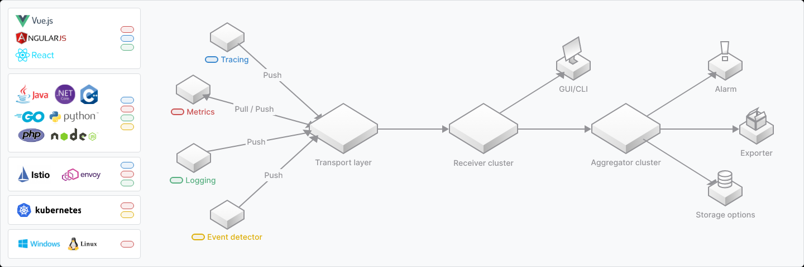
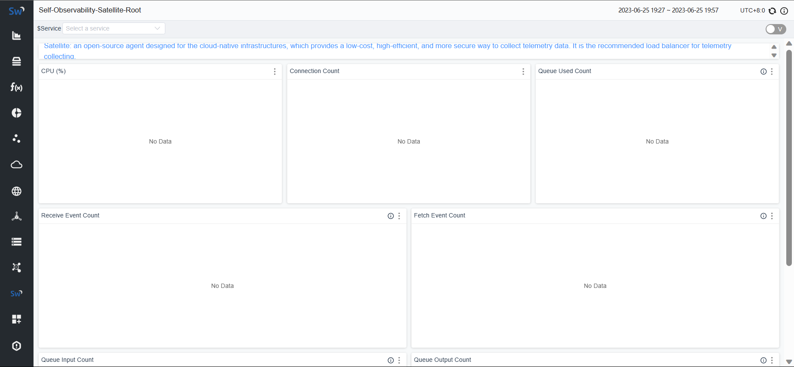
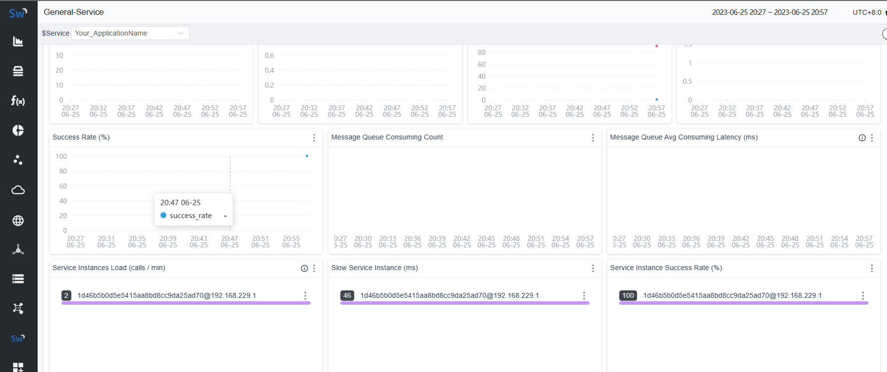

## 简介

skywalking 是 Java 编写的开源的 APM（应用性能监视）系统，用于监视和诊断分布式系统，并提供实时性能分析、告警和故障诊断等功能，可用于云原生架构中

skywalking 一大特点是提供无侵入或低侵入的方式监控

skywalking 主要提供功能如下：

+ 分布式跟踪
+ 堆栈代理
+ 支持成熟的遥测生态系统
+ 原生 APM 数据库
+ 一致的指标聚合
+ 日志管理管道
+ 警报和遥测管道



## 快速开始

### 运行 skywalking 后端以及 dashboard

下载 skywalking apm：[Downloads | Apache SkyWalking](https://skywalking.apache.org/downloads/)

解压后运行 bin/startup.bat

访问：127.0.0.1:8080 可以看到 UI 面板



### Jave agent

文档：[Setup java agent | Apache SkyWalking](https://skywalking.apache.org/docs/skywalking-java/v8.16.0/en/setup/service-agent/java-agent/readme/)

下载：

要监测大部分 Java 应用，只需要在运行 java 程序时，加上参数运行即可，默认支持大部分 Java 框架

```
-javaagent:/path/to/skywalking-package/agent/skywalking-agent.jar
```

启动了一个最简单的 SpringBoot 应用，可以看到如下




## K8S环境安装

k8s可以使用 helm 安装 skywalking：[apache/skywalking-helm at v4.5.0 (github.com)](https://github.com/apache/skywalking-helm/tree/v4.5.0)

skywalking 一般使用 elasticsearch作为存储后端

1. 用helm安装一个测试用 elasticsearch,账号为`elastic `,密码为`elastic`

helm：[弹性搜索 8.5.1 ·弹性/弹性 (artifacthub.io)](https://artifacthub.io/packages/helm/elastic/elasticsearch)

```sh
helm repo add elastic https://helm.elastic.co
helm install es-skywalking elastic/elasticsearch \
--version 7.17.3 \
-n skywalking-demo --create-namespace \
--set replicas=1 \
--set volumeClaimTemplate.resources.requests.storage=1Gi \
--set secret.password='elastic' 
```

2. 部署 skywalking

```sh
helm install skywalking \
  oci://registry-1.docker.io/apache/skywalking-helm \
  --version "4.5.0" \
  -n "skywalking-demo" \
  --create-namespace \
  --set oap.image.tag=9.2.0 \
  --set oap.storageType=elasticsearch \
  --set ui.image.tag=9.2.0 \
  --set elasticsearch.enabled=false \
  --set elasticsearch.config.host="elasticsearch-master.skywalking-demo" \
  --set elasticsearch.config.user="elastic" \
  --set elasticsearch.config.password="elastic" \
  --set oap.replicas=1 \
  --set oap.javaOpts="-Xmx512m -Xms512m"
```


卸载：

```
helm uninstall skywalking -n skywalking-demo
helm uninstall es-skywalking -n skywalking-demo

```


## 组件

### 基础组件

+ SkyWalking APM

  可观测性分析平台和应用程序性能管理系统

+ Rocketbot UI

  SkyWalking 的主要 UI

### 代理组件

代理组件主要提供各个语言项目的上报跟踪信息能力

主要一下语言和组件代理：

+ Java
+ Python
+ Go
+ NodeJs
+ Nginx LUA
+ Kong
+ ...

###  Operation

+ SkyWalking CLI

  SkyWalking CLI 是 SkyWalking 用户或 OPS 团队的命令交互工具。

+ Kubernates Helm

  在 k8s 环境的安装脚本

+ SkyWalking Cloud on Kubernetes


### 数据库

+ BanyanDB Server
+ BanyanDB Java Client

### 开发测试工具

+ skywalking eyes

  一种全功能许可证工具，用于检查和修复许可证头，并解决依赖项的许可证问题。

+ skywalking infra e2e

  一种端到端测试框架，旨在帮助开发人员轻松设置、调试和验证端到端测试。

## Java Agent

一般而言，快速开始的方式能够满足大部分场景

其他情况可以参考：[Setup java agent | Apache SkyWalking](https://skywalking.apache.org/docs/skywalking-java/v8.16.0/en/setup/service-agent/java-agent/readme/)

### 启动配置

使用agent启动后，会把跟踪获取到的信息上传到 skywalking 后端，默认情况下上传到本地 `127.0.0.1:11800`，可以通过环境变量配置

```
# 配置SW后端
SW_AGENT_COLLECTOR_BACKEND_SERVICES=192.168.229.128:31516
# 配置上传到SW后端的应用名
SW_AGENT_NAME=midi
```

### 容器环境

#### 使用 skywalking jdk 构建镜像

docker 镜像可以基于官方镜像构建，这样启动 Java 程序就会自动启动 Java Agent

```dockerfile
FROM apache/skywalking-java-agent:8.5.0-jdk8
```

#### 使用代理

如果不方便使用官方 jdk 构建镜像，也可以继续用命令行参数的方式启动 Java 程序

```
-javaagent:/path/to/skywalking-package/agent/skywalking-agent.jar
```

### k8s 环境

使用初始容器把 skywalking 的 jar 包挂到容器中，然后使用启动参数启动

```yaml
apiVersion: v1
kind: Pod
metadata:
  name: agent-as-sidecar
spec:
  restartPolicy: Never

  volumes:
    - name: skywalking-agent
      emptyDir: { }

  initContainers:
    - name: agent-container
      image: apache/skywalking-java-agent:8.7.0-alpine
      volumeMounts:
        - name: skywalking-agent
          mountPath: /agent
      command: [ "/bin/sh" ]
      args: [ "-c", "cp -R /skywalking/agent /agent/" ]

  containers:
    - name: app-container
      image: springio/gs-spring-boot-docker
      volumeMounts:
        - name: skywalking-agent
          mountPath: /skywalking
      env:
        - name: JAVA_TOOL_OPTIONS
          value: "-javaagent:/skywalking/agent/skywalking-agent.jar"
```

启动 agent 时，如果 skywalking 地址不为默认，可在 `config/agent.config` 修改

### 手动跟踪

使用 agent 的方式，有官方和社区支持，可以监控大部分场景，但有些场合仍需要侵入到程序才能跟踪监控：

+ 使用 GraalVM 本机镜像
+ 官方没适配框架
+ ...

#### 添加工具包

```xml
   <dependency>
      <groupId>org.apache.skywalking</groupId>
      <artifactId>apm-toolkit-trace</artifactId>
      <version>${skywalking.version}</version>
   </dependency>
```

#### trace 模型

为了理解 skywalking 跟踪模型你需要理解下面这些概念：[Trace Data Protocol | Apache SkyWalking](https://skywalking.apache.org/docs/main/v9.5.0/en/api/trace-data-protocol-v3/)

`EntrySpan`：表示服务提供者，也是服务器端的端点。作为一个 APM 系统，SkyWalking 针对的是应用服务器。因此，几乎所有的服务和 MQ 消费者都是 EntrySpans。

`LocalSpan`：表示与远程服务无关的跟踪片段（典型代表就是 Java 方法）。它既不是 MQ 生产者/消费者，也不是服务的提供者/消费者（例如 HTTP 服务）。

`ExitSpan`：典型代表是客户端的服务或 MQ 生产者。在 SkyWalking 的早期版本被称为 LeafSpan。例如，通过 JDBC 访问数据库，以及读取 Redis/Memcached 均归类为 ExitSpans。

`跨线程/进程父 span`：称为“reference”。参考承载了 trace ID、segment ID、span ID、service name, service instance name, endpoint name 以及用于 client 的目标地址（注意：在跨线程操作中，这并不是必需的）中的此请求的信息。欲了解更多详情，请参阅 https://skywalking.apache.org/docs/main/v9.5.0/en/api/x-process-propagation-headers-v3

`Span＃skipAnalysis`：如果 span 不需要进行后端分析，可能为 TRUE


#### trace API

创建一个 Span

```java
SpanRef spanRef = Tracer.createEnteySpan("${operationName}", null);
```

创建一个 LocalSpan

```java
SpanRef spanRef = Tracer.createLocalSpan("${operationName}");
```

创建一个 ExitSpan

```java
SpanRef spanRef = Tracer.createExitSpan("${operationName}", "${remotePeer}");
```

停止当前 span

```java
Tracer.stopSpan();
```


更多请参考官网：[Create Span | Apache SkyWalking](https://skywalking.apache.org/docs/skywalking-java/v8.16.0/en/setup/service-agent/java-agent/application-toolkit-tracer/)

## 参考

[apache/skywalking：APM，应用程序性能监控系统 (github.com)](https://github.com/apache/skywalking)