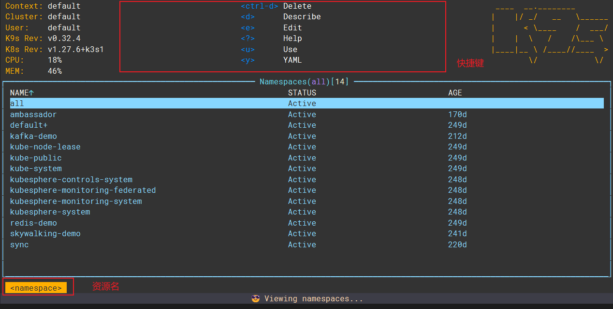
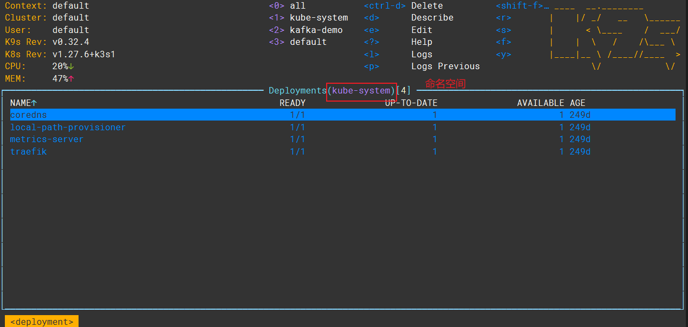
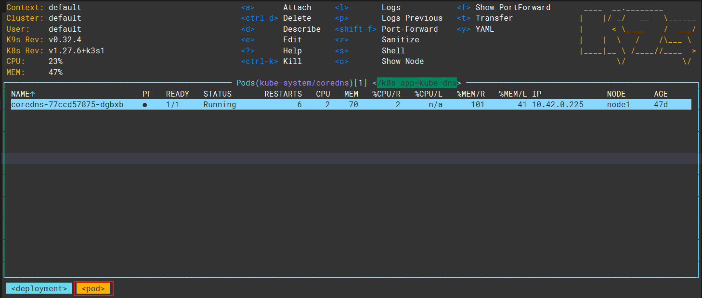

## 简介
K9S 是一个命令行工具，用于管理 Kubernetes 集群，操作逻辑类似 Vim

## 下载

推荐直接下载对应CPU架构的单个二进制文件到服务器

Github 地址：[derailed/k9s: 🐶 Kubernetes CLI To Manage Your Clusters In Style! (github.com)](https://github.com/derailed/k9s)

Release 地址：[Releases · derailed/k9s (github.com)](https://github.com/derailed/k9s/releases)

## 启动

启动：`./k9s`

启动时，默认会以 `~/.kube/config` 文件作为集群配置文件

## 基本使用

### 面板概览

#### 概览

namespace 资源面板如下

deployment 资源面板如下

资源名，常见的有：

+ deployment
+ statefulset
+ job
+ namespace
+ pod
+ service
+ configmap
+ secret
+ pvc
+ pv
+ ...

命名空间（namespace）：当前查看列表使用的namespace过滤条件，为all时表示所有namespace

快捷键：按下即可执行对应操作

Enter键：会根据不同资源执行不同动作，例如在namespace下执行，会切换全局namespace，并查看相关资源。总的来说，Enter键表示进行所属于某个资源的下一层资源，例如在Depolyment按下时，进入的是Pod；在Pod时，进入Container

ESC：退出当前资源/返回上一层状态

#### 命令模式操作

在面板时，可以按下键盘 `:` 进入命令模式，输入命令完成操作，常见命令如下：

+ 退出编辑模式：按下键盘`ESC`

+ 退出 k9s : `q!`

+ 切换查看资源：`<resource-name>`，例如要查看 deployment `deployments`
+ 命令补全：输入部分命令后按下 Tab 

#### 搜索模式操作

在面板时，可以按下键盘 `/` 进入搜索模式，输入过滤关键字可以过滤资源，按 Enter 应用搜索条件

### 常用操作

#### 查看Pod日志

用于查看Pod打印在控制台的日志

切换到Pod资源（或者在deployment、statefulset按下enter键进入）

注意图中快捷键，按下`l`即可查看日志，按下`p`查看上一次pod终止时的日志

#### 进入容器的 shell

切换到Pod/container资源，按下 `s` 即可进入终端，在终端中执行 `exit` 退出

#### 修改资源 yaml

切换到需要修改的资源，如 deployment，按下 `e` ，即进入 vim 编辑模式，可以编辑资源 Yaml
