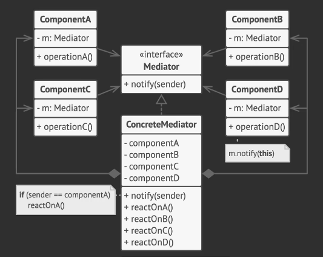
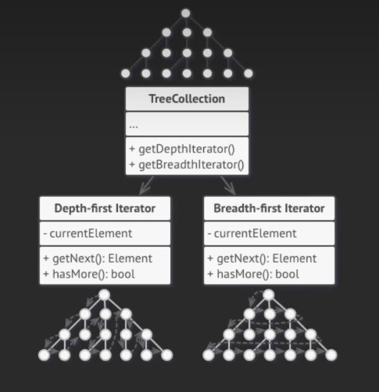
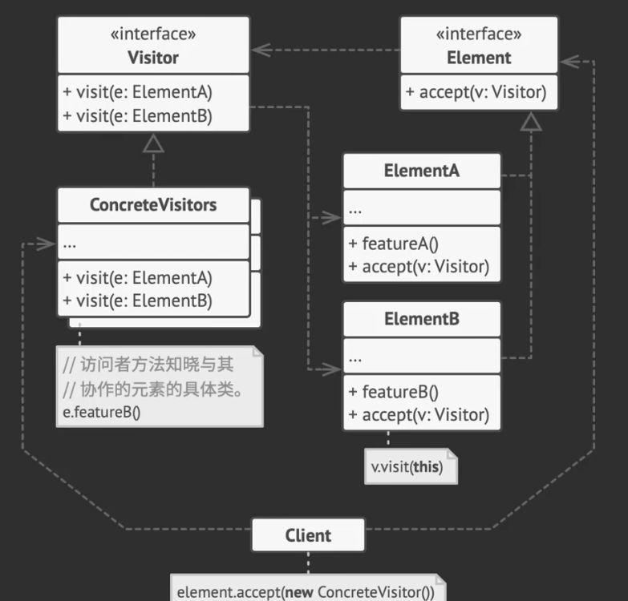
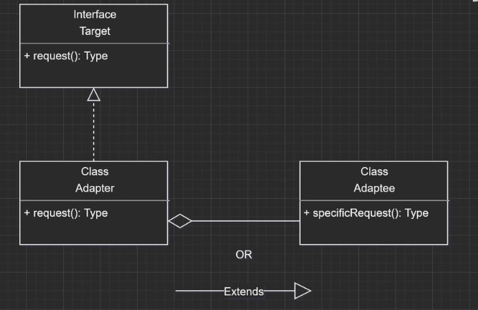
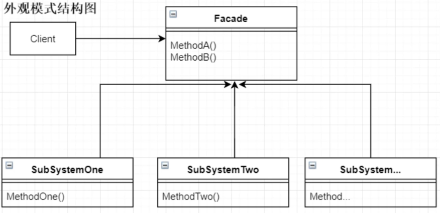
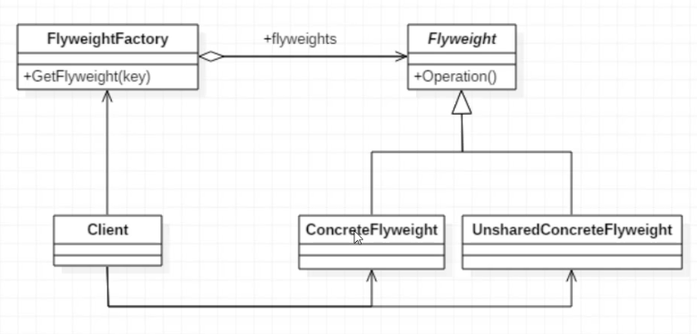
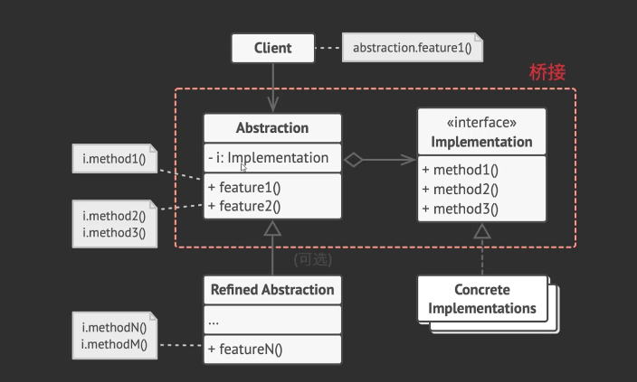
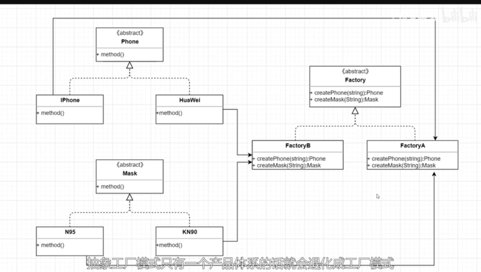
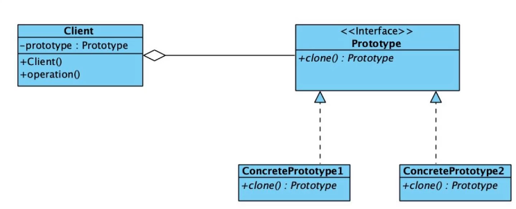

# 简介和分类

**创建型模式：对象实例化的模式，创建型模式用于解耦对象的实例化过程。**

**结构型模式：把类或对象结合在一起形成一个更大的结构。**

**行为型模式：类和对象如何交互，及划分责任和算法。**


单例模式：某个类只能有一个实例，提供一个全局的访问点。

简单工厂：一个工厂类根据传入的参量决定创建出那一种产品类的实例。

工厂方法：定义一个创建对象的接口，让子类决定实例化那个类。

抽象工厂：创建相关或依赖对象的家族，而无需明确指定具体类。

建造者模式：封装一个复杂对象的构建过程，并可以按步骤构造。

原型模式：通过复制现有的实例来创建新的实例。

适配器模式：将一个类的方法接口转换成客户希望的另外一个接口。

组合模式：将对象组合成树形结构以表示“”部分-整体“”的层次结构。

装饰模式：动态的给对象添加新的功能。

代理模式：为其他对象提供一个代理以便控制这个对象的访问。

亨元（蝇量）模式：通过共享技术来有效的支持大量细粒度的对象。

外观模式：对外提供一个统一的方法，来访问子系统中的一群接口。

桥接模式：将抽象部分和它的实现部分分离，使它们都可以独立的变化。

模板模式：定义一个算法结构，而将一些步骤延迟到子类实现。

解释器模式：给定一个语言，定义它的文法的一种表示，并定义一个解释器。

策略模式：定义一系列算法，把他们封装起来，并且使它们可以相互替换。

状态模式：允许一个对象在其对象内部状态改变时改变它的行为。

观察者模式：对象间的一对多的依赖关系。

备忘录模式：在不破坏封装的前提下，保持对象的内部状态。

中介者模式：用一个中介对象来封装一系列的对象交互。

命令模式：将命令请求封装为一个对象，使得可以用不同的请求来进行参数化。

访问者模式：在不改变数据结构的前提下，增加作用于一组对象元素的新功能。

责任链模式：将请求的发送者和接收者解耦，使的多个对象都有处理这个请求的机会。

迭代器模式：一种遍历访问聚合对象中各个元素的方法，不暴露该对象的内部结构。

# 行为型模式

## 策略模式

常见于：生成ID策略

定义一系列算法，把他们封装起来，并且使它们可以相互替换。例如，把生成ID的算法定义统一为一个接口。实际使用时，可以自由替换为各种算法，比如雪花算法，UUID算法。

```java
public interface IdArithmetic {
    String getId();
}

```


## 责任链模式

将请求的发送者和接收者解耦，使的多个对象都有处理这个请求的机会。直到处理成功

常见于：SpringSecurity权限验证拦截


初级责任链的实现

```java
public class ChainRespPattern {
    public static void main(String[] args) {
        // 模拟
        Handler level1 = new Leader();
        Handler level2 = new Boss();
        level1.setNextHandler(level2);

        level1.process(12);
    }
}

abstract class Handler{
    protected Handler nextHandler;

    public void setNextHandler(Handler nextHandler) {
        this.nextHandler = nextHandler;
    }

    public abstract void process(Integer level);
}

class Leader extends Handler{
    @Override
    public void process(Integer level) {
        if(level<10){
            System.out.println("leader 处理");
        }else{
            nextHandler.process(level);
        }
    }
}

class Boss extends Handler{
    @Override
    public void process(Integer level) {
        if(level>=10){
            System.out.println("boss 处理");
        }
    }
}
```

## 观察者模式

观察者模式：对象间的一对多的依赖关系。

当一个对象的状态发生变化时，其相关依赖的对象皆得到通知并自动更新。

```java
public class ObserverPattern {
    public static void main(String[] args) {
        PersonDebit zhangSan = new PersonDebit();
        PersonCredit liSi = new PersonCredit("lisi");
        PersonCredit wangWu = new PersonCredit("wangWu");

        zhangSan.borrow(liSi);
        zhangSan.borrow(wangWu);

        zhangSan.notifyCredits();
    }
}

interface Debit{
    void borrow(Credit credit);
    void notifyCredits();
}

interface Credit{
    void takeMoney();
}

class PersonCredit implements Credit{

    private String name;

    public PersonCredit(String name) {
        this.name = name;
    }

    @Override
    public void takeMoney() {
        System.out.println(name+"拿钱");
    }
}

class PersonDebit implements Debit{
    private List<Credit> allCredis = new ArrayList<>();
    private Integer state = 0; // 0表示没钱，1表示有钱

    @Override
    public void borrow(Credit credit) {
        allCredis.add(credit);
    }

    @Override
    public void notifyCredits() {
        allCredis.forEach(credit -> {credit.takeMoney();});
    }
}
```

## 状态模式

状态模式：允许一个对象在其对象内部状态改变时改变它的行为，对象看起来似乎修改了它的类，其别名为状态对象


```java
package StatePattern;

public class StatePattern {
    public static void main(String[] args) {
        Context zhangsan = new Context();
        zhangsan.changeState(new Happy());
        zhangsan.doSomething();

        zhangsan.changeState(new Angry());
        zhangsan.doSomething();
    }
}
abstract class State{
    abstract void doWork();
}

class Happy extends State{
    @Override
    void doWork() {
        System.out.println("happy");
    }
}

class Angry extends State{
    @Override
    void doWork() {
        System.out.println("angry");
    }
}

class Context{
    private State state;
    public void changeState(State state){
        this.state = state;
    }
    public void doSomething(){
        state.doWork();
    }
}
```

## 模板方法模式

模板模式：定义一个算法结构，而将一些步骤延迟到子类实现。使得子类可以不改变一个算法的结构即可重新定义该算法的某些特定步骤。


```java
package TemplateMethodPattern;

public class TemplateMethodPattern {
    public static void main(String[] args) {
        Cooking cooking = new CookingFood();
        cooking.cook();
    }
}

abstract class Cooking{
    protected abstract void step1();
    protected abstract void step2();
    public void cook(){
        System.out.println("做饭开始");
        step1();
        step2();
        System.out.println("做饭结束");
    }
}

class CookingFood extends Cooking{
    @Override
    protected void step1() {
        System.out.println("放鸡蛋和西红柿");
    }

    @Override
    protected void step2() {
        System.out.println("少放盐多放味精");
    }
}	
```

## 命令模式

命令模式：将命令请求封装为一个对象，它可以将请求转换为一个包含于请求相关的所有信息的独立对象。该转换让你根据不同的请求将方法参数化、延迟请求执行或将其放入队列中，且能实现可撤销操作。

```java
package CommandPattern;


public class CommandPattern {
    public static void main(String[] args) {
        SaveButton saveButton = new SaveButton();
        TextBox box = new TextBox();
        
        PrintCommand printCommand = new PrintCommand(box);
        saveButton.bindCommand(printCommand);

        box.setContext("abcd");
        saveButton.doPrint();

        box.setContext("adda");
        saveButton.doPrint();
    }
}

// 文本编辑器文本框
class TextBox{


    private String context;

    public String getContext() {
        return context;
    }

    public void setContext(String context) {
        this.context = context;
    }
}

class SaveButton{
    private Command command;

    public void bindCommand(Command command){
        this.command = command;
    }
    public void doPrint(){
        if(command==null) throw new RuntimeException("设备初始化失败");
        command.execute();
    }
}

class PrintService{
    public void print(String text){
        System.out.println(text);
    }
}

interface Command{
    void execute();
}
class PrintCommand implements Command{

    private TextBox box;
    private PrintService serviceProvider = new PrintService();
    public PrintCommand(TextBox box) {
        this.box = box;
    }


    @Override
    public void execute() {
        serviceProvider.print(box.getContext());
    }
}
```


## 备忘录模式

备忘录模式：在不破坏封装的前提下，保持对象的内部状态。

备忘录模式：允许在不暴露对象实现细节的情况下保存和恢复对象之前的状态。


```java
package MementoPattern;

import java.util.Stack;

public class MementoPattern {
    public static void main(String[] args) {
        History history = new History();
        Document document = new Document();
        document.change("abc");
        history.add(document.save());

        document.change("def");
        history.add(document.save());

        document.change("ghi");
        history.add(document.save());

        document.change("lmb");

        document.resume(history.getLastVersion());
        document.print();

        document.resume(history.getLastVersion());
        document.print();

    }
}

class Document{
    // 需要备份的数据
    private String content;

    public BackUp save(){
        return new BackUp(content);
    }

    public void resume(BackUp backUp){
        content = backUp.content;
    }

    public void change(String content){
        this.content = content;
    }

    public void print(){
        System.out.println(content);
    }

}

/**
 * 备忘录接口
 * 定义元数据方法
 */
interface Memento{

}

class BackUp implements Memento{
    String content;
    public BackUp(String content){
        this.content = content;
    }
}

/**
 * 备忘录栈
 */
class History{
    Stack<BackUp> backUpStack = new Stack<>();
    public void add(BackUp backUp){
        backUpStack.add(backUp);
    }

    public BackUp getLastVersion(){
        return backUpStack.pop();
    }
}
```


## 中介者模式

中介者模式：用一个中介对象来封装一系列的对象交互。

能让你减少对象之间混乱无序的依赖关系。该模式会限制对象之间的直接交互，迫使它们通过一个中介者对象进行合作。




```java
package MediatorPattern;

import java.util.ArrayList;
import java.util.List;

public class MediatorPattern {
    public static void main(String[] args) {
        // 定义中介者
        MarriageAgency marriageAgency = new MarriageAgencyImpl();
        //第一位男嘉宾
        Person manA = new Person("Giao桑",18,Sex.MALE,18,marriageAgency);
        Person womanA = new Person("女1",18,Sex.FEMALE,18,marriageAgency);
        Person womanB = new Person("女2",17,Sex.FEMALE,18,marriageAgency);
        Person womanC = new Person("女3",18,Sex.FEMALE,18,marriageAgency);

        marriageAgency.register(womanA);
        marriageAgency.register(womanB);
        marriageAgency.register(womanC);

        // 缘分一线牵
        marriageAgency.pair(manA);
    }
}

class Person{
    String name;
    int age;
    Sex sex;
    int requestAge;
    MarriageAgency agency;
    public Person(String name,int age,Sex sex,int requestAge,MarriageAgency agency){
        this.name = name;
        this.age = age;
        this.sex = sex;
        this.requestAge = requestAge;
        this.agency = agency;

    }

    public void findPartner(){
        agency.pair(this);
    }
}

enum Sex{
    MALE,FEMALE;
}

interface MarriageAgency{
    // 注册会员
    void register(Person person);
    // 为person配对
    void pair(Person person);
}

class MarriageAgencyImpl implements MarriageAgency{
    List<Person> people = new ArrayList<>();

    @Override
    public void register(Person person) {
        people.add(person);
    }

    @Override
    public void pair(Person person) {
        for(Person p:people){
            if(p.age == person.requestAge && p.sex != person.sex){
                System.out.println(
                        new StringBuilder().append("将").append(person.name)
                        .append("与").append(p.name).append("送入洞房")
                        .toString()
                );
            }
        }
    }
}
```


## 迭代器模式

迭代器模式：一种遍历访问聚合对象中各个元素的方法，不暴露该对象的内部结构。

迭代器模式：是一种行为模式，让你能在不暴露底层表现形式（列表，栈，树）的情况下遍历集合中所有的元素。



## 访问者模式

访问者模式：在不改变数据结构的前提下，增加作用于一组对象元素的新功能。

访问者模式：用于封装一些作用于某种数据结构中各元素的操作，它可以在不改变数据结构的前提下定义作用于这些元素的新的操作。



```java
package VisitorPattern;

public class VisitorPattern {
    public static void main(String[] args) {
        EggRobot erDan = new EggRobot();
        erDan.calc();
        Visitor updatePack = new UpdateVisitor();
        erDan.accept(updatePack);
        erDan.calc();
    }
}

class EggRobot{
    private HardDisk disk;
    private CPU cpu;

    public EggRobot(){
        disk = new HardDisk("记住 1+1=1");
        cpu = new CPU("1+1=1");
    }

    public void calc(){
        cpu.run();
        disk.run();
    }

    public void accept(Visitor visitor){
        cpu.accept(visitor);
        disk.accept(visitor);
    }
}
interface Visitor{
    void visitCPU(CPU cpu);
    void visitDisk(HardDisk hardDisk);
}
class UpdateVisitor implements Visitor{
    @Override
    public void visitCPU(CPU cpu) {
        cpu.command += ":1+1=2";
    }

    @Override
    public void visitDisk(HardDisk disk) {
        disk.command += ":记住:1+1=2";
    }
}


abstract class Hardware{
    String command;
    public Hardware(String command){
        this.command = command;
    }
    public void run(){
        System.out.println(command);
    }
    public abstract void accept(Visitor visitor);
}

class CPU extends Hardware{
    public CPU(String command){
        super(command);
    }

    @Override
    public void accept(Visitor visitor) {
        visitor.visitCPU(this);
    }
}

class HardDisk extends Hardware{
    public HardDisk(String command){
        super(command);
    }

    @Override
    public void accept(Visitor visitor) {
        visitor.visitDisk(this);
    }
}
```


# 结构型模式

## 装饰模式

装饰模式：动态的给对象添加新的功能。【实际感觉把原有方法进行封装，成为新方法也可以】

常用于：Java io 流大量使用装饰模式	

和继承的区别：

+ 继承是静态的，一定要写一个新的子类，对类层级进行扩展。
+ 装饰模式是动态的，拿到一个对象就能对它进行扩展，不修改原有类的逻辑。


示例代码

```java
package DecoratorPattern;

public class DecoratorPattern {
}

interface Robot{
    void doSomething();
}

class FirstRobot implements Robot{
    @Override
    public void doSomething() {
        System.out.println("对话");
        System.out.println("唱歌");
    }
}

class RobotDecorator implements Robot{
    private Robot robot;
    public RobotDecorator(Robot robot) {
        this.robot = robot;
    }

    @Override
    public void doSomething() {
        robot.doSomething();
    }

    public void doMorething(){
        robot.doSomething();
        System.out.println("跳舞，拖地");
    }
}

```

## 适配器模式

适配器模式：将一个类的方法接口转换成客户希望的另外一个接口。

和装饰器刚好相反，装饰器修改原接口，将接口扩展。适配器是让接口兼容

常见于：

使用方式：可以用继承或者关联（组合）的方式实现



## 外观模式

外观模式：对外提供一个统一的方法，来访问子系统中的一群接口。



## 代理模式

代理模式：为其他对象提供一个代理以便控制这个对象的访问。

常用于：对象增强、运行时aop织入(jdk动态代理、cglib等)

静态代理：一个类通常就需要维护一个代理类

动态代理：能根据需要动态生成

```java
package ProxyPattern;

public class ProxyPattern {
    public static void main(String[] args) {
        new RealSubjectProxy().doWork();
    }
}
interface Subject{
    void doWork();
}

class RealSubject implements Subject{
    @Override
    public void doWork() {
        System.out.println("doWork");
    }
}

class RealSubjectProxy implements Subject{
    private RealSubject subject;

    public RealSubjectProxy() {
        try{
            this.subject = (RealSubject)this.getClass().getClassLoader().loadClass(RealSubject.class.getName()).newInstance();

        }catch (Exception e){
            e.printStackTrace();
        }
    }

    public RealSubjectProxy(RealSubject subject) {
        this.subject = subject;
    }

    public void connect(){
        System.out.println("建立连接");
    }

    public void log(){
        System.out.println("日志记录");
    }

    @Override
    public void doWork() {
        connect();
        subject.doWork();
        log();
    }
}
```

## 享元模式

亨元（蝇量）模式：通过共享技术来有效的支持大量细粒度的对象。

主要用于减少创建对象的数量，以减少内存占用和提高性能。



```java
package FlyweightPattern;

import java.util.HashSet;
import java.util.Set;

public class FlyweightPattern {
    public static void main(String[] args) {
        BikeFlyWeight bike1 = BikeFlyWeightFactory.getInstance().getBike();
        bike1.ride("张三");
        bike1.back();

        BikeFlyWeight bike2 = BikeFlyWeightFactory.getInstance().getBike();
        bike2.ride("李四");

        BikeFlyWeight bike3 = BikeFlyWeightFactory.getInstance().getBike();
        bike3.ride("王五");
        bike3.back();

        System.out.println(bike1==bike2);
        System.out.println(bike2==bike3);
    }
}

abstract class BikeFlyWeight{
    protected Integer state = 0;

    abstract void ride(String userName);
    abstract void back();
    public Integer getState(){
        return state;
    }
}

class MoBikeFlyWeight extends BikeFlyWeight{

    private String bikeId;

    public MoBikeFlyWeight(String bikeId) {
        this.bikeId = bikeId;
    }

    @Override
    void ride(String userName) {
        state = 1;
        System.out.println(userName+"骑"+bikeId+"号 自行车出行!");
    }

    @Override
    void back() {
        state = 0;
    }
}
class BikeFlyWeightFactory{
    private static BikeFlyWeightFactory instance = new BikeFlyWeightFactory();
    private Set<BikeFlyWeight> pool = new HashSet<>();

    public static BikeFlyWeightFactory getInstance(){
        return instance;
    }
    private BikeFlyWeightFactory(){
        for(int i=0;i<2;i++){
            pool.add(new MoBikeFlyWeight(i+"号"));
        }
    }
    public BikeFlyWeight getBike(){
        for(BikeFlyWeight bike:pool){
            if(bike.getState()==0){
                return bike;
            }
        }
        return null;
    }
}
```


## 组合模式

组合模式：将对象组合成树形结构以表示“”部分-整体“”的层次结构。


```java
package CompositePattern;

import java.util.ArrayList;
import java.util.List;

public class CompositePattern {
    public static void main(String[] args) {
        Composite china = new Composite();
        china.add(new City(1000)); // 北京
        china.add(new City(1000)); // 上海

        Composite shanXi = new Composite();
        shanXi.add(new City(3000)); // 大同市
        shanXi.add(new City(3000)); // 太原市

        china.add(shanXi);

        System.out.println(china.count());
    }
}

/**
 * 统计接口
 */
interface Counter{
    int count();
}

class City implements Counter{

    private int sum = 0;

    public City(int sum){
        this.sum = sum;
    }

    @Override
    public int count(){
        return sum;
    }
}

class Composite implements Counter{
    private List<Counter> counterList = new ArrayList<>();
    public void add(Counter counter){
        counterList.add(counter);
    }
    public void delete(Counter counter){
        counterList.remove(counter);
    }
    public List<Counter> getChild(){
        return counterList;
    }

    @Override
    public int count() {
        int sum = 0;
        for(Counter counter:counterList){
            sum += counter.count();
        }
        return sum;
    }
}
```


## 桥接模式

桥接模式：将抽象部分和它的实现部分分离，使它们都可以独立的变化。桥接模式将继承关系转换为关联关系。



```java
package BridgePattern;

public class BridgePattern {
}

abstract class Abstraction{
    private Implementor implementor;

    public Abstraction(Implementor implementor) {
        this.implementor = implementor;
    }

    public void doWork(){
        this.implementor.doSomething();
    }
}

/**
 * 实现接口
 */
interface Implementor{
    public void doSomething();
}

class ConcreteImplementor implements Implementor{
    @Override
    public void doSomething() {
        System.out.println("Hello world");
    }
}
```


# 创建型模式

## 单例模式

某个类只能有一个实例，提供一个全局的访问点。

常见于：Spring、配置类等

### 枚举实现

```java
public enum EnumSingleton {

    INSTANCE();
    private int id = new Random().nextInt(100);

    EnumSingleton() {
    }

    @Override
    public String toString() {
        return "EnumSingleton{" +
                "id=" + id +
                '}';
    }

    public static EnumSingleton getInstance(){
        return INSTANCE;
    }
    public static void main(String[] args) {
        Runnable thread1 = ()->{
            System.out.println(EnumSingleton.getInstance());
        };
        for(int i = 0;i<40;i++){
            new Thread(thread1).start();
        }

    }
}
```

### 双重锁检查

```java
package Singleton;

/** 使用双重锁检查实现单例
 * @author xiaoso
 * @date 2021/8/5 9:37
 */
public class DoubleCheck {
    private volatile static DoubleCheck singleton;
    private DoubleCheck(){

    }
    public static DoubleCheck getInstance(){
        if(singleton==null){
            synchronized (DoubleCheck.class){
                if(singleton==null){
                    singleton = new DoubleCheck();
                }
            }
        }
        return singleton;
    }

    public static void main(String[] args) {
        Runnable thread1 = ()->{
            System.out.println(DoubleCheck.getInstance());
        };
        for(int i = 0;i<40;i++){
            new Thread(thread1).start();
        }

    }

}

```

### 懒汉

```java
public class ESingleton {
    private static  ESingleton eSingleton = new ESingleton();
    private ESingleton(){}
    public static ESingleton getInstance(){
        return eSingleton;
    }
    public static void main(String[] args) {
        Runnable thread1 = ()->{
            System.out.println(ESingleton.getInstance());
        };
        for(int i = 0;i<40;i++){
            new Thread(thread1).start();
        }

    }
}
```

### 静态内部类

```java
package Singleton;

/** 使用静态内部类实现单例模式
 * @author xiaoso
 * @date 2021/8/5 9:57
 */
public class StaticInsideClass {
    private StaticInsideClass(){

    }
    private static class Singleton{
        private static final StaticInsideClass INSTANCE = new StaticInsideClass();
    }
    public static StaticInsideClass getInstance(){
        return Singleton.INSTANCE;
    }
    public static void main(String[] args) {
        Runnable thread1 = ()->{
            System.out.println(StaticInsideClass.getInstance());
        };
        for(int i = 0;i<40;i++){
            new Thread(thread1).start();
        }

    }
}
```

## 简单工厂模式

简单工厂：一个工厂类根据传入的参量决定创建出那一种产品类的实例。被创建的实例应该有共同的父类。

常用于：广泛在JDK中使用，比如日期类等等

## 工厂模式

工厂方法：定义一个创建对象的接口，让子类决定实例化那个类。将实例化延迟到子类进行。当我们需要新的产品（工厂生产的实例时），不需要修改工厂类，而是需要新建一个子类（子工厂）。

常用于：广泛在 JDK 中使用，比如Collection集合iterator() 方法，交给子类返回迭代器

注意：工厂模式要求这里属于一个大类


## 抽象工厂模式

抽象工厂：创建相关或依赖对象的家族，而无需明确指定具体类。

抽象工厂打破了工厂与产品（大类）一一对应的关系，一个具体的工厂类可以生产多个大类的产品



## 建造者模式

建造者模式：封装一个复杂对象的构建过程，并可以按步骤构造。

```java
package BuilderPattern;

import lombok.Data;

public class BuilderPattern {
    public static void main(String[] args) {
        House house = new House.Builder()
                .setDoor(new Door() {})
                .setWall(new Wall() {})
                .setWindow(new Window() {})
                .build();

    }
}
interface Window{}
interface Door{}
interface Wall{}

class House{
    private Window window;
    private Door door;
    private Wall wall;

    public House(Builder builder){
        this.window = builder.window;
        this.door = builder.door;
        this.wall = builder.wall;
    }


    static final class Builder{
        private Window window;
        private Door door;
        private Wall wall;

        public Builder setWindow(Window window) {
            this.window = window;
            return this;
        }

        public Builder setDoor(Door door) {
            this.door = door;
            return this;
        }

        public Builder setWall(Wall wall) {
            this.wall = wall;
            return this;
        }
        public House build(){
            return new House(this);
        }
    }
}

```


## 原型模式

原型模式：通过复制现有的实例来创建新的实例。让实现类自己实现clone接口



```java
package PrototypePattern;

public class PrototypePattern {
    public static void main(String[] args) {
        Plane plane = new Plane();
        System.out.println(plane);

        Plane clone = plane.clone();
        System.out.println(clone);
    }
}

interface Prototype{
    Object clone();
}

class Plane implements Prototype{
    private String name;
    private String type;
    public Plane(){
        this.name = "Name:" + Math.random();
        this.type = "Type:" + Math.random();
    }
    public Plane(Plane plane){
        this.name = plane.name;
        this.type = plane.type;
    }
    public String getName() {
        return name;
    }

    public String getType() {
        return type;
    }

    @Override
    public Plane clone() {
        return new Plane(this);
    }

    @Override
    public String toString() {
        return "Plane{" +
                "name='" + name + '\'' +
                ", type='" + type + '\'' +
                '}';
    }
}

```

# 参考

[23种设计模式总结_和代码去流浪的博客-CSDN博客_设计模式](https://blog.csdn.net/lgxzzz/article/details/124970034)

[重学 Java 设计模式：实战责任链模式「模拟618电商大促期间，项目上线流程多级负责人审批场景」 | bugstack 虫洞栈](https://bugstack.cn/md/develop/design-pattern/2020-06-18-重学 Java 设计模式《实战责任链模式》.html)

[五分钟学设计模式.10.策略模式_哔哩哔哩_bilibili](https://www.bilibili.com/video/BV1vT4y1E7g6/?spm_id_from=333.788)

